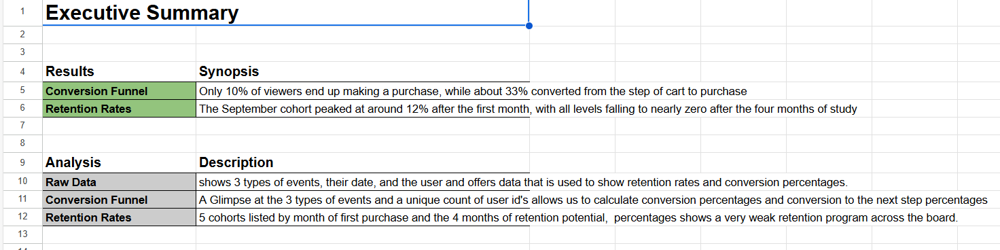
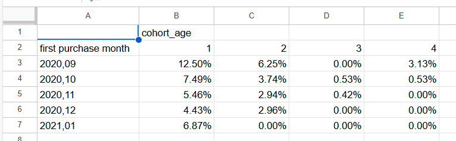

# E-Commerce User Analysis

## 📘 Project Overview

As a Junior Analyst at an e-commerce company, my role was to evaluate website performance by analyzing raw transaction logs. The executive team wanted a better understanding of how effectively product page views converted into purchases and how customer retention varied over time.

The project involved:
- Creating a **conversion funnel** using user event data
- Building **acquisition cohorts** based on users’ first purchase month
- Calculating **retention rates** month over month
- Providing actionable recommendations to improve conversion and retention

---

## 📊 Analysis

<a href=“” >Analysis Report</a>

### Data Description
The raw dataset consisted of user events classified into three main types:
- **Product View**
- **Add to Cart**
- **Purchase**

Each event included a timestamp and a user ID, allowing us to track user behavior chronologically.

---

### Conversion Funnel
By counting unique users at each step, we built a conversion funnel:
- **10%** of users who viewed a product eventually made a purchase
- **33%** of users who added a product to their cart completed a purchase

This highlights key drop-off points in the buying journey.

---

### Retention Rates
Users were grouped into **monthly acquisition cohorts** based on the month of their **first purchase**. Retention was measured across the next four months.

Key insights:
- The **September cohort** had the strongest first-month retention (~12%)
- Retention dropped significantly by month four across all cohorts
- Overall retention rates were **very low**, suggesting limited repeat engagement

---

## 🧠 Conclusions

- The product-to-purchase conversion rate is **low (10%)**, indicating potential friction in the product or checkout experience.
- Although **1 in 3 cart users convert**, many users abandon the buying process after showing initial intent.
- Retention efforts are underperforming, with **drop-offs to nearly zero** within four months post-purchase.

---

## ✅ Recommendations

### Conversion Funnel
- **Improve product page design** with stronger CTAs, reviews, and urgency triggers
- **Simplify add-to-cart flow** and test personalization for better engagement
- **Reduce cart abandonment** with follow-up emails, discounts, and trust signals at checkout

### Retention Strategy
- Implement **post-purchase lifecycle campaigns** (emails, upsells, loyalty rewards)
- **Segment cohorts** by acquisition source and purchase type for targeted outreach
- Launch **re-engagement efforts** (win-back emails, retargeting ads) for dormant users

---

📈 *Next Steps:*
- Build an automated **dashboard** to monitor funnel performance and cohort metrics
- Explore **Customer Lifetime Value (CLV)** by cohort
- Collect qualitative feedback to identify user pain points
